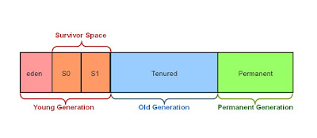

# 자바 실행 과정
```java
class Hellow {
    public static void main(String[] args) {
        System.out.println("Hellow world");
    }
}
```
위 코드와 같이 Hellow.java 파일을 생성하여 실행 시 아래와 같은 순서로 동작을 하게된다.

1. java 코드를 작성한다.
2. 자바 컴파일러가 javac.exe를 사용하여 .java로 부터 바이트 코드인 클래스 파일(.class)을 생성(컴파일)한다.
3. 클래스로더가 동적로딩을 통해 생성된 클래스 파일(바이트코드)들을 JVM 메모리 영역에 할당한다.
4. 자바 인터프리터(java.exe)로 실행한다.
5. "Hellow world"가 출력된다.

JAVA에서 가장 처음 읽어 들이는 부분의 위 코드에서 보이는 main 메서드이다. 프로그램을 실행하면 자바 인터프리터가 main 메서드를 호출하도록 되어있다.

### compiler
소스코드를 기계어로 컴파일하여 실행파일을 생성하여 실행한다.\
컴파일러가 개발자가 작성한 원시코드를 기계어로 변환하여 실행파일을 만든다.\
런타임 상황에 모든 코드는 기계어로 변환되어 있다.

자바 소스 코드(.java)를 자바 컴파일러가 바이너리 코드(.class)로 컴파일 한다.

### class loader
자바는 동적으로 클래스를 읽어온다. 프로그램이 실행중인 런타임에서 모든 코드가 JVM과 연결된다. 이렇게 동적으로 클래스를 로딩해주는 역할이 클래스로더이다.\
클래스로더는 .class 파일을 묶어서 JVM이 운영체제로부터 할당받은 메모리 영역인 Runtime Date Area로 적재한다.

## JVM 메모리 구조


JVM(Java Virtual Machine)은 자바 프로그램 실행환경을 만들어주는 소프트웨어이다.
JVM은 자바 실행 환경 JRE(Java Runtime Environment)에 포함 되어있다.

JVM은 메모리 용도에 따라 주요 3가지 주요 영역(method area, call stack, heap)으로 나누어 관리된다.

## Runtime data Area (런타임 데이터 영역)
### 메서드 영역 (Method Area)
클래스가 사용되면 JVM은 .class 파일을 읽어 클래스의 정보를 이곳에 저장한다. 이 때, 그 클래스의 클래스 변수도 이 영역에 함께 생성된다.\
모든 쓰레드가 공유하는 영역으로, JVM이 동작되고 프로그램이 종료될 때까지 유지된다.\
저장되는 정보 : 클래스, 인터페이스, 메서드, 변수, static 등

### 힙 (heap): 언제든지 넣고 언제든지 뺄 수 있는 공간 
인스턴스가 생성되는 공간이다. 실행 중 생성된 모든 인스턴스는 이곳에 생성된다. (객체, 배열, 문자열 등)\
쓰레드간 공유가 되지만 각 인스턴스는 자신의 주소값을 가지고 있다.
주기적으로 [GC(Garbage Collection)](/2024-01/Garbage-Collection)가 메모리를 확인 후 제거한다.

Heap영역은 설계시 두가지의 전제로 설계되었다.
1. 대부분의 객체는 금방 접근 불가능한 상태(Unreachable)가 된다.
2. 오래된 객체에서 새로운 객체로의 참조는 아주 적게 존재한다.



<span style="color: red;">객체는 대부분 일회성이며, 메모리에 오래동안 남아있는 경우는 드물다.</span> 하여 물리적 영역을 아래와 같이 나누었다.\
*Perm 영역이 존재하였으나 java8 부터는 제거되었다.*

힙 영역은 Young Generation, Old Generation 두가지 영역으로 나뉜다.
#### Young Generation :
새로 생성된 객체들이 할당되는 영역이다. 또 다시 Eden과 Survivor (S0, S1)으로 구성된다.
* Eden : new를 통해 새로 생성된 객체가 할당, 정기적으로 정리 후 남은 객체들은 Survivor 영역으로 이동
* Survivor(0, 1) : 각 영역이 채워지게 되면, 살아남은 객체는 비워진 Survivor로 순차적으로 이동. 남은 객체들의 서브 공간으로 이용

#### Old Generation :
생명주기가 긴 객체를 GC 대상으로 하는 영역 Young Generation에서 마지막까지 살아남은 객체가 할당

**위 이미지에서 Old가 더 공간이 큰것은 Old 영역의 객체는 오래 유지되어 가비지가 적게 발생하기 때문에 그만큼 메모리 공간이 더 크다.**

> new를 통해 처음 메모리가 할당이 되면 Eden에 저장되고 공간이 모두차면 GC가 한번 처리하여 사용하지 않는 것들을 제거 후 남은 객체는 Survivor0에 이후 모두 다 차면 Survivor1로 그 이후 또 다차면 Old로 이동하는 방식으로 동작한다.

### 스택 (stack | execution stack) : 먼저 넣은 것이 나중에 나오고 나중에 넣은게 먼저 나옴 (LIFO)
메서드 작업에 필요한 메모리 공간을 제공\
메서드가 호출되면 메모리가 할당되고, 메모리는 메서드가 작업을 수행하는 동안 지역변수들과 연산의 중간결과 등을 저장한다.\
메서드의 작업이 끝나면 할당되었던 메모리 공간은 반환되어 비워진다.

> - 메서드가 호출되면 수행에 필요한 만큼의 메모리 스택에 할당받는다
> - 메서드가 수행을 마치고나면 사용했던 메모리를 반환하고 스택에서 제거된다.
> - 호출스택의 제일 위헤 있는 메서드가 현재 실행 중인 메서드이다.
> - 아래에 있는 메서드가 바로 위의 메서드를 호출한 메서드이다.

### PC Register (프로그램 카운터 레지스터)
각 쓰레드마다 존재하며 현재 실행중인인 JVM 명령어의 주소를 저장한다.\
현재 수행중인 메서드나 명령의 위치를 가리키는데 사용한다.

### Native Method Stack(네이티브 메서드 스택)
바이트 코드가 아닌 기계어로 작성된 프로그램을 호출하고 저장하는 영역이다.
네이티브 방식의 메소드가 있다면 해당 영역에 쌓인다.


## Excution Engine

메모리에 적재된 .class(byte code)들을 기계어(Binary code)로 변경하여 명령어 단위로 실행한다.\
인터프리터와 JIT컴파일러 두 가지 방식을 이용한다.

* [Interpreter](#interfreter)
* [JIT compiler](#jitjust-in-time-compiler)

### interfreter
코드를 한 줄씩 읽어 내려가며 실행한다.\
소스코드를 기계어로 변환하는 과정 없이 한줄씩 해석하여 바로 명령어를 실행\
컴파일된 바이너리 코드(.class)를 인터프리터인 JVM(Java Vertual Machine)에서 실행한다.

### JIT(Just-In-Time) Compiler
프로그램이 실행되는 동안 특정 메소드나 코드 블록이 여러번 호출되는 구간을 찾아 기계어로 변환하여 최적화된 네이티브 코드를 생성하고 캐시에 저장하여 재사용한다.


