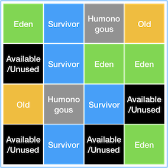
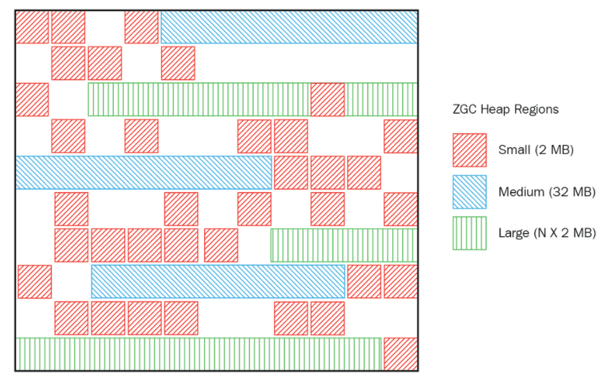

# Garbage Collector(GC)
자동으로 메모리를 관리하여 프로그래머가 명시적으로 메모리를 해제할 필요가 없도록 한다.\
주로 Heap 메모리 영역에서 사용되지 않는 객체를 주기적으로 탐지하고 제거하는 역할을 한다.

## GC의 장단점
#### GC의 장점
C/C++ 언어에서는 GC가 없어 프로그래머가 수동으로 메모리를 할당하고 해제해야 했지만 JAVA에서는 JVM에 탑재되어 있는 GC가 메모리 관리를 해주기 때문에 메모리관리, 메모리누수 문제에 신경쓰지 않고 개발에만 집중할 수 있게 되었다.

#### GC의 단점
위와 같은 장점이 있지만 단점도 존재한다. 프로그래머가 언제 메모리가 해제 되는지 알 수 없고, GC가 동작하는 중 다른 동작을 멈추면 오버헤드가 발생한다.

## Heap 메모리
JVM에는 객체가 생성시 Heap 메모리에 할당이 된다.
([Heap 메모리](/2023-12/jvm#힙-heap-언제든지-넣고-언제든지-뺄-수-있는-공간))

#### Minor GC : 
Young 영역이다.
대부분의 객체는 생성 후 금방 Unreachable하게 되며 Heap 메모리의 Young 영역에 생성이 된다.

#### Major GC:
Old 영역이다. Young영역에서 살아남은 객체가 할당된다. Old 영역에 생성된다.

## GC의 동작방식
GC는 기본적으로 다음과 같은 동작을 진행하게 된다.
1. Stop The World
2. Mark and Sweep

#### Stop The World
JVM이 GC를 실행 시키기 위해 애플리케이션의 실행을 멈추는 작업이다.\
GC를 실행하는 쓰레드를 제외한 모든 쓰레드들의 작업이 중단되기 때문에 GC 성능 개선 튜닝을 한다고 하면 보통 Stop The World의 시간을 줄이는 작업을 하게 된다.

#### Mark and Sweep
* Mark: 사용되는 메모리와 사용하지 않는 메모리를 식별하는 작업
* Sweep: 사용하지 않는 메모리를 제거하는 작업

Stop The World를 통해 작업이 중단되면 GC는 스택의 모든 변수 또는 Reachable 객체를 스캔하여 사용되고 있는 메모리를 식별한다. 이후 사용되지 않는 메모리들은 제거한다.

## GC Algorithm
GC는 자동으로 메모리 관리를 해주는 것은 프로그래머에게 좋은 점이다. 그러나 GC가 동작하기 위해 Stop The World가 발생하고 애플리케이션이 중지되는 문제점이 생겼다.\
또한 Heap의 사이즈가 커지면서 애플리케이션의 지연(Suspend) 현상이 두드러지게 되었고 이를 막기 위한 다양한 Garbage Algorithm을 지원하고 있다.

#### Serial GC
Serial GC의 Minor에서 Mark Sweep을 사용하고 Major GC에서는 Mark Sweep Compact를
 사용한다.\
Compact는 Heap 영역을 정리하기 위한 단계로 GC가 사용하지 않는 객체를 제거 후 남은 객체들을 앞부분으로 당겨 중간에 빈공간을 채워주는 역할을 한다.\
GC를 처리하는 1개의 쓰레드만 사용하여 stop-the-world 시간이 길다.
```bash
java -XX:+UseSerialGC -jar Application.java
```

#### Parallel GC
Throughput GC로도 알려져 있다. 여러개의 쓰레드를 통해 Parallel하게 GC를 수행함으로써 GC의 오버헤드를 상당히 줄여준다.\
멀티 프로세서 또는 멀티 쓰레드 머신에서 중간에서 대규모의 데이터를 처리하는 애플리케이션을 위해 고안되었으며 최대지연시간 또는 GC를 수행하는 쓰레드의 개수 등을 설정할 수 있다.

Serial GC와 기본 처리과정은 동일하지만 Minor GC(Young 영역)를 멀티쓰레드로 수행한다. (Old는 싱글)

java8까지 기본 GC 알고리즘으로 사용되었다. 그럼에도 애플리케이션이 중단되는 문제를 피할 수 없었다. 이를 개선하기 위해 다른 알고리즘들이 등장했다.
```bash
java -XX:+UseParallelGC -jar Application.java

# 사용할 쓰레드의 갯수
-XX:ParallelGCThreads=3

# 최대 지연 시간
-XX:MaxGCPauseMillis=1000
```

#### Parallel Old GC
Parallel GC을 개선된 버전이다. Young과 Old 모두 멀티쓰레드로 수행한다. Mark Summary Compaction를 사용한다.

#### CMS GC (Concurrent Mark Sweep)
어플리케이션과 GC의 쓰레드가 동시에 실행되어 stop-the-world 시간을 최대한 줄이기 위해 고안되었다.\
하지만 다른 GC 방식보다 메모리와 CPU를 더 많이 필요로 하여 Compaction 단계를 수행하지 않는 단점이 있다.\
java9 부터 deprecated 되었고 java14 부터는 사용이 중지되었다.

```bash
# deprecated in java9 and finally dropped in java14
java -XX:+UseConcMarkSweepGC -jar Application.java
```

#### G1 GC (Gargabe First)
CMS GC를 대체하기 위해 개발하였고 jdk7 부터 지원하였다. java9의 디폴트 GC로 지정되었다.\
기존의 GC 알고리즘은 Heap 메모리를 물리적으로 Young(Eden, Survivor), Old로 나누어 사용하였지만 G1은 메모리 공간을 나누지 않는다. 대신 Region(지역)이라는 개념을 도입하여 Heap을 균등하게 여러 지역으로 나누고 각 지역을 역할과 논리적으로 구분하여(Eden인지 Survivor인지 Old인지) 객체를 동적으로 할당한다.



대규모 힙에 대한 효과적인 GC를 제공하며 메모리 크기가 큰 어플리케이션의 성능을 향상시켜준다.\
G1 GC는 전체 힙을 일정한 크기의 Region으로 나누고 garbage가 많은 Region에 대해서 우선적으로 GC를 수행한다. 이를 통해 GC 빈도를 줄인다.

```bash
java -XX:+UseG1GC -jar Application.java
```

#### Z GC
다음의 목표를 충족시키기 위해 java11부터 추가되었다.
* stop-the-world 처리시간이 10ms를 초과하지 않음
* 힙 크기가 증가해도 stop-the-world 처리시간이 증가하지 않음
* 8MB ~ 16TB에 이르는 스펙트럼의 힙 처리가 가능
* G1 GC보다 애플리케이션 처리량이 15% 이상 떨어지지 않을 것

Z GC는 ZPages 개념을 사용한다. G1 GC의 Region과 비슷한 개념이지만 ZPages는 크기가 2MB의 배수로 동적으로 생성 및 삭제될 수 있다.



```bash
java -XX:+UnlockExperimentalVMOptions -XX:+UseZGC -jar Application.java
```
