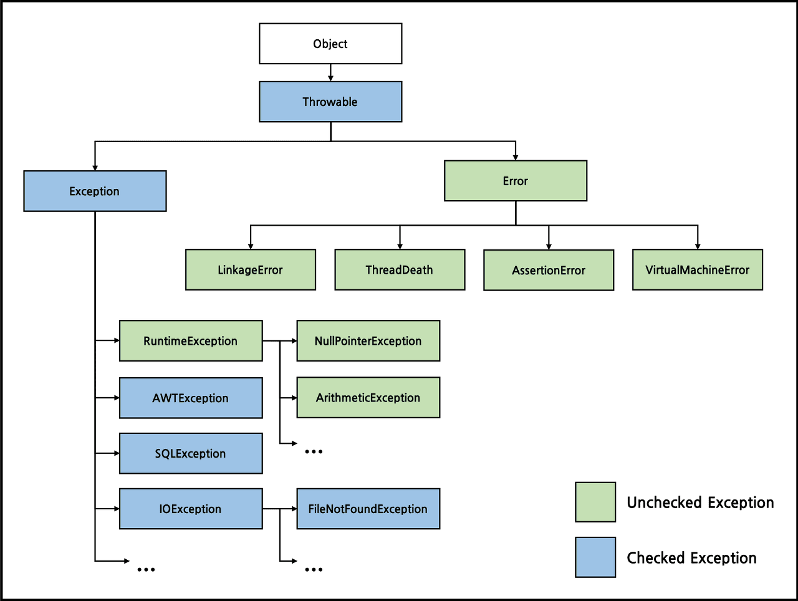
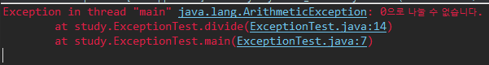
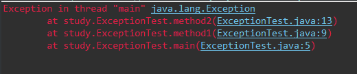

## Error와 Exception
같은 의미처럼 보이지만 명확히 다르다.

프로그램의 실행도중 발생할 수 있는 모든경우의 수를 고려하여 이에 대한 대비를 하는것이 필요하다.\
자바에서는 실행 시(runtime) 발생 할 수 있는 프로그램 오류를 에러(error)와 예외(Exception) 두 가지로 구분하였다.

* 에러: 프로그램이 실행 중 어떤 원인에 의해서 오작동을 하거나 비정상적으로 종료되는 경우.\
    🖍 OutOfMemoryError, StackOverFlowError, ThreadDeath 등 개발자가 예측하기 어렵고 처리할 수 있는 방법이 없을때

* 예외: 개발자의 실수로 예기치 않은 상황이 발생하거나, 개발자가 직접 처리할 수 있는 미약한 에러.\
    🖍 변수, 조건식 오타, 구현 괄호 누락 등

## Checked, Unchecked Exception
Excpetion은 Checked, Unchecked로 구분할 수 있다. 간단하게 RuntimeException을 상속하지 않은 클래스는 CheckedException, 반대로 상속한 클래스는 UncheckedException으로 분류 한다.




### Checked Exception
* RuntimeException을 상속하지 않은 클래스
* 컴파일 시점에 컴파일에서 확인하는 예외
* 반드시 예외를 처리해야 한다.

다음과 같은 예시들의 예외들이 있다.
* IOException: 파일 또는 네트워크 연결에서 입/출력 작업과 관련된 오류
* SQLException: 데이터베이스 엑세스 및 쿼리와 관련된 오류
* ClassNotFoundException: 동적으로 클래스 로드와 관련된 오류
* ParseException: 날짜나 시간 등을 파싱할 때 발생하는 예외.

### Unchecked Exception
* RuntimeException을 상속하는 클래스
* 런타임(실행단계) 단계에서 확인 가능
* 에러처리를 강제하지 않는다.

다음과 같은 예시들의 예외들이 있다.
* NullPointerException: null인 객체를 참조할 경우
* ArrayIndexOutOfBoundsException: 배열에서 유효하지 않은 인덱스에 접근할 경우
* ArithmeticException: 예외적인 산술연산이 수행될 경우

## Try-Catch
예외 발생 시 비정상적인 종료를 막고 정상적인 실행상태를 유지할 수 있도록 한다.\
checked Exception은 반드시 예외를 처리해주어야 하는데 이때 하나의 방법으로 try-catch를 사용할 수 있다.

```java
try {
    // Checked Exception이 발생하는 구간
} catch(IOException ioe) {
    // IOException이 발생하였을 때 처리하기 위한 코드 작성.
} catch(ParseException pe) {
    // ParseException이 발생하였을 때 처리하기 위한 코드 작성.
} catch(ClassNotFoundException cnfe) {
    // ClassNotFoundException이 발생하였을 떄 처리하기 위한 코드 작성.
}
```

jdk1.7 이후 부터는 멀티 catch를 지원한다.
```java
try {
    // ....
} catch (ParseException | ClassNotFoundException e) {
    e.printStackTrace();
}
```

### printStackTrace(), getMessage()
* printStackTrace(): 예외 발생 시 stack에 있는 메서드의 정보와 예외 메시지를 로그에 출력한다.
* getMessage(): 발생한 예외 클래스의 인스턴스에 저장된 메시지를 호출한다.

### finally
try-catch문과 함께 예외의 발생 여부 상관없이 실행되어야 할 코드를 포함시킬 목적으로 사용한다.

```java
try {
    // ....
} catch (ParseException e) {
    e.printStackTrace();
} finally {
    // 예외 발생여부 상관없이 수행.
}
```
 
## 예외 발생시키기 (throw, throws)

### throw
개발자가 의도적으로 예외를 발생 시킬 수 있는데 이떄, `throw`를 사용하면 된다.
```java
class ExceptionTest {
    public static void main(String[] args) {
        int a = 7;
		int b = 0;
		divide(a, b);
		System.out.println("정상적 종료");
    }

    public static int divide(int a, int b) {
		if (b == 0) {
			throw new ArithmeticException("0으로 나눌 수 없습니다.");
		}
		return a / b;
	}
}
```

위 코드가 실행되면 아래와 같은 에러가 나타난다.

Exception이 발생한 지점에서 jvm이 예외를 처리하고 종료시켜 메서드를 호출한 divide() 이후 더이상 동작하지 않는다.

### throws
만약 개발자가 메서드 내에서 사용하지 않고 해당 메서드를 호출한 곳에서 예외 처리를 하려면 `throws`를 사용하면 된다.

```java
class ExceptionTest {
    public static void main(String[] args) throws Exception {
		method1();
	}
	
	public static void method1() throws Exception {
		method2();
	}
	
	public static void method2() throws Exception {
		throw new Exception();
	}
}
```


예외가 발생한 메서드에서 예외처리를 하지 않고 자신을 호출한 메서드에게 예외를 넘겨줄 수 있지만, 이것으로 예외가 처리된 것이 아니라 단순히 전달을 하는것이다.\
결국 어딘가는 try-catch로 처리해주어야 한다.