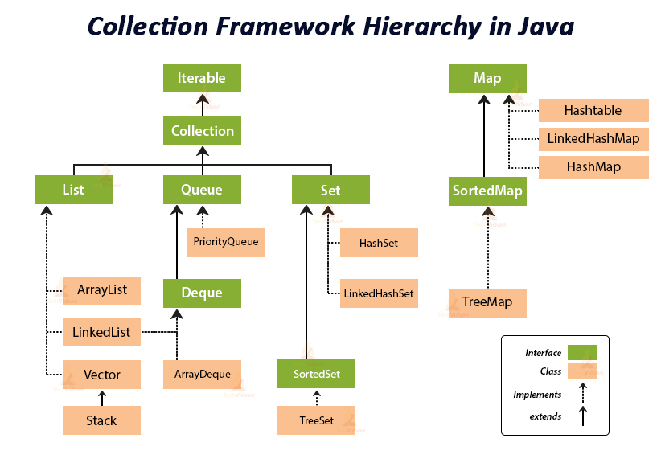

## Collection Freamwork
컬렉션(Collection)은 다수의 데이터, 즉 데이터 그룹을 다루는데 필요한 다양한 자료구조를 말한다.\
인터페이스와 다형성을이용한 객체지향적 설계를통해 표준화되어 사용법을 이해하기 쉽고 재사용성이 높은 코드를 작성할 수 있는 장점이 있다.

> 
💡 배열을 사용하지 않고 Collection을 사용하는 이유

> 배열과의 차이점은 동적 메모리 할당을 할 수 있다.
 

인터페이스 Collection은 List, Set, Queue 인터페이스가 상속하고 있는 상위의 인터페이스이고, 각 인터페이스는 다음과 같다.\
Map은 인터페이스를 상속받고 있지 않지만 Collection으로 분류한다.

| 인터페이스 | 특징 |
| --------- | ---- |
| List      | * 데이터의 순서 있음  * 데이터 중복 허용  구현클래스: ArrayList, LInkedList, Stack, Vector 등 |
| Set       | * 데이터 순서 없음  * 데이터의 중복을 허용하지 않음  * 구현클래스: HashSet, TreeSet 등  |
| Map       | * 키(Key)와 값(Value)의 쌍으로 이루어진 데이터  * 데이터 순서 없음  * 키의 중복이 되지 않음  * 값의 중복 허용  * 구현클래스: HashMap, TreeMap, Hashtable, Properties 등 |
| Queue     | * 처음에 저장한 데이터를 가장 먼저 꺼낸다.(FIFO) |
| Stack     | * 마지막에 저장한 데이터를 가장 먼저 꺼낸다.(LIFO) |

### ArrayList
기존의 Vector를 개선한 클래스. 인터페이스 List를 구현하고 있다.
* 조회에 성능이 좋으며 순차적으로 데이터 추가/삭제가 빠르다.
* 중간에 데이터들이 추가/삭제가 일어날 경우 느리다.
* List 컬렉션을 여러 스레드에서 공유한다면 Thread safe하지 않다.

### LinkedList
* 중간에 데이터를 추가/삭제 처리시에 성능이 좋다.
* 검색이 느리다.
* 스택, 큐 등을 만들때 사용한다.

### HashSet
* 빠른 데이터 접근을 할 수 있다.
* 순서를 예측할 수 없다.
* Thread safe 하지 않다.

### TreeSet
* 정렬 방법을 지정할 수 있다. (기본 오름차순)
* Thread safe 하지 않다.
* 검색에 빠르다.
* 이진 검색 트리

### LinkedHashSet
* 입력된 순서대로 저장한다.
* Thread safe 하지 않다.

### Hashtable
* HashMap보다 느리지만 동기화를 지원한다.
* null 불가
* Thread safe 하지 않다.

### HashMap
* 데이터 추가/삭제/검색 모두 성능이 좋다.
* 중복과 순서가 허용되지 않는다.
* null 허용

#### 동작원리
HashMap은 키에 대한 해시 값을 사용하여 값을 저장하고 조회하여 동적으로 크기가 증가하는 연관배열(associate array)이다.\
💡 associate array: 키 하나와 값 하나가 연관되어 있으며 키를 통해 연관되는 값을 얻을 수 있는 자료구조

어떠한 두 객체가 X.equals(Y)가 '거짓'이고 두 해시코드가 같지 않다면 이때 사용하는 해시 함수는 `완전한 해시 함수(perfect hash functions)`라고 한다.

기본자료형은 완전한 해시 함수로 구현할 수 있지만 String, POJO(Plain old java object)는 사실상 불가능하다.
> 왜 안되는거지?? 객체가 서로 다른데 해시코드가 같다??? 어떤 경우가 있는거지???

HashMap은 버킷의 위치를 정할 때 객체의 해시코드를 사용한다. 이 때 해시코드의 결과 자료형은 int인데, 32비트 정수 자료형(int)으로는 완전한 자료 해시 함수를 만들 수 없다.

논리적으로 2^32보다 더 많은 객체를 생성할 수 있기 때문이다. 설령 가능하여도 그 만큼의 데이터를 생성하는 것은 엄청난 메모리 낭비이며 배열을 사용하는 것과 다르지 않아 의미가 없다.

따라서 메모리를 절약하기 위해 표현해야 할 N의 범위보다 적은 M만큼의 배열을 사용한다. (예를들어 총 50개의 정수를 가지고 해시자료 구조를 사용하면 버킷을 15개 정도 사용하는 것이다.)
> int index = X.hashCode() % M;

HashMap은 객체의 hashCode() 메서드의 반환 값을 사용한 hashCode() % BUCKET_SIZE 수식을 사용하여 데이터를 저장/조회를 할 버킷 위치를 계산한다. 위 수식을 사용하여 데이터를 BUCKET_SIZE 내의 위치에 값을 저장할 수 있게 된다.

## 해시 값 충돌시?
그럼 데이터는 무한에 가깝다 보니 결국 해시의 충돌이 일어날 수 있는데 이떄 해결하기 위한 대표적인 두가지 방법이 있다.

* 개방 주소법(Open Addressing): 충돌이 발생하면 다른 버킷에 데이터를 저장
* 분리 연결법(Seperate Chaining): 
* 체이닝 기법: 각 버킷은 연결 리스트의 헤더를 가리키고, 충돌이 발생하면 연결 리스트에 데이터를 저장

### 개방 주소법(Open Addressing)
추가적인 메모리를 사용하는 Chaining 방식과 다르게 비어있는 해시 테이블의 공간을 활용하는 방법이다.
1. Linear Probing: 만약 h[k]에서 충돌이 일어난다면 h[k + 1]이 비어있는지 확인 후 비어있지 않다면 h[k + 2]... 식으로 계속 확인하는 방법이다.
2. Quadratic Probing: 해시의 저장순서 폭을 제곱으로 저장하는 방식이다. 예를들어 처음 충돌이 발생하는 경우 1만큼 이동하고 그 다음 계속 충돌이 일어나면 2^2, 3^2 칸씩 옮기는 방법이다.
3. Double Hashing Probing: 해시된 값을 한번 더 해싱하여 새로운 주소를 할당하기 때문에 다른 방법보다 많은 연산을 한다.

### 분리 연결법(Seperate Chaining)
Java HashMap에서 사용하는 방법이다. Seperate Chaining이란 동일한 버킷 데이터에 대해 List or Tree 자료구조를 이용해서 추가 메모리를 사용하여 다음 데이터의 주소를 저장하는 방식이다.

그리고 충돌이 많이 발생하여 리스트의 형태로 계속 쌓이게 되면 검색하는데 시간복잡도가 O(n)으로 나빠지게 된다. 그래서 Java8의 HashMap은 리스트의 개수가 8개 이상이 되면 Self-Balancing Binary Search Tree 자료구조를 사용해 Chaining 방식을 구현한다.(탐색할 때 O(logN)으로 성능이 좋아진다.)

  
### TreeMap
* 정렬을 가진 Map, 검색이 빠르다.
* 이진 검색 트리
