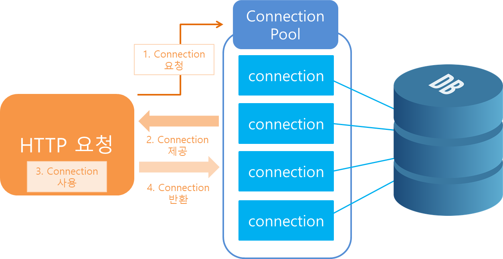
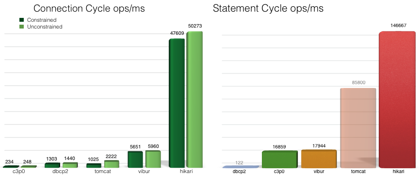

## 커넥션 풀(Connection Pool)이란?
웹 컨테이너(WAS)가 실행되면서 데이터베이스와 미리 connection(연결)을 해놓은 객체들을 pool에 저장해두었다가 클라이언트 요청이 오면 connection을 빌려주고, 처리가 끝나면 다시 connection을 반납받아 pool에 저장하는 방식이다.

여러 클라이언트가 동시에 데이터베이스에 연결할 수 있도록 하고, 연결을 효율적으로 사용하여 애플리케이션과 데이터베이스 간의 성능을 향상시키고 부하를 줄이는 데 도움을 준다.

### 커넥션 풀 동작 구조

1. 초기화: 애플리케이션이 시작될 때 미리 정의된 수의 커넥션 객체를 생성하여 풀에 저장한다.
2. 요청처리: 클라이언트의 요청이 오면 미리 생선된 Connection 중 사용 가능한 Connection을 제공한다. 부족할 경우 새로 생성한다.
3. 사용 및 반환: 클라이언트가 데이터베이스 작업을 마치면 해당 Connection을 Pool에 반환한다. 이떄, 연결을 닫지 않고 풀에 반환한다.
4. 유휴 연결 관리: 일정 시간동안 사용되지 않은 Connection은 유휴 상태로 간주되어 풀에서 제거될 수 있다. 이를 통해 연결 리소스를 효율적으로 관리한다.

### Hikari CP
Hikari CP는 가벼운 용량과 빠른 속도를 가지는 우수한 성능의 JDBC Connection Pool이다.
스프링 부트 2.0 이후부터 커넥션 풀을 관리하기 위해 Hikari CP를 채택하여 사용하고 있다.

Hikari CP의 경우 처음 커넥션을 요청하다가 재요청시 이전에 사용했던 커넥션을 확인 후 이를 우선적으로 반환받지만 존재하지 않는다면 HandOffQueue를 Polling하면서 다른 Thread가 Connection을 반납하기를 기다린다.(지정한 TimeOut 시간까지 대기하다가 시간이 만료되면 예외를 던진다.)