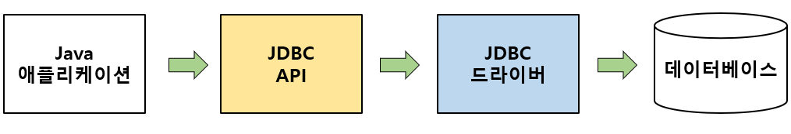

## JDBC(Java DataBase Connectivity)란?
JAVA 애플리케이션을 데이터베이스와 연결되어 데이터를 주고 받을 수 있게 해주는 프로그래밍 인터페이스.

예를들어 애플리케이션의 데이터를 데이터베이스에 저장하거나 조회할때 사용하는 SQL을 직접 데이터베이스에 작성하여 수행하던 일을 JDBC를 이용하여 대신 처리하도록 한다.

Java는 이미 표준 인터페이스인 JDBC API를 제공하고 있기 때문에, 어떤 DB이든 같은 방식으로 DB를 핸들링 할 수 있다.

JDBC는 총 3가지 기능을 표준 인터페이스로 정의하여 제공한다.
1. java.sql.Connection - 연결
2. java.sql.Statement - SQL을 담을 내용
3. java.sql.ResultSet - SQL 요청 응답

## JDBC 동작


JDBC는 Java 애플리케이션 내에서 JDBC API를 사용하여 데이트베이스에 접근하는 단순한 구조이다.\
JDBC API를 사용하기 위해서 JDBC 드라이버를 먼저 로딩한 후 데이터베이스와 연결하게 된다.

#### JDBC 드라이버
* 데이터베이스와 통신을 담당하는 인터페이스
* Oracle, MS-SQL, MySQL 등과 같은 데이터베이스에 알맞은 JDBC 드라이버를 구현하여 제공
* JDBC 드라이버의 구현체를 이용해서 특정 벤더의 데이터베이스에 접근

### JDBC API 처리 과정
1. JDBC 드라이버 로딩\
사용하고자 하는 JDBC 드라이버를 로딩한다. JDBC 드라이버는 DriverManager 클래스를 통해 로딩된다.
2. Connection 객체 생성\
JDBC 드라이버가 정상적으로 로딩되면 DriveManager를 통해 데이터베이스와 연결되는 세션인 Connection 객체를 생성한다.
3. Statement 객체 생성\
Connection 객체로부터 sql문을 DB에 전달하여 실행하고 결과를 리턴 받는 객체
4. Query 실행\
생성된 Statement 객체를 이용하여 입력한 SQL 쿼리를 실행한다.
1. ResultSet 객체로부터 데이터 조회\
실행된 SQL 쿼리문에 대한 결과 데이터 셋이다.
1. ResultSet 객체 Close
2. Statement 객체 Close
3. Connection 객체 Close

## JDBC Transaction
트랜잭션은 논리적 작업 단위이다. 하나의 작업에 대해서 단위별 진행 중 한 단위가 실패하는 경우 해당 단위의 수행된 모든 작업은 실행 취소될 수 있고 데이터베이스는 트랜잭션이 시작되기 전의 이전 상태로 돌아갈 수 있다.

트랜잭션은 데이터 무결성, 올바른 애플리케이션 시맨틱 및 동시 액세스 중에 일관된 데이터 보기를 제공하기 위해 사용된다.

---
하나 이상의 쿼리가 모두 정상적으로 실행되었을 떄 `데이터의 무결성`이 유지된다고 한다.
> **데이터 무결성**\
> 데이터의 Lifecycle 동안 모든 데이터가 얼마나 완전하고, 일관되며, 정확한지를 나타내는 정도. 같은 말로 '데이터 안정성'이라고도 한다.

만약 하나의 작업을 위해 하나 이상의 쿼리가 실행되어야 하며 모두가 정상적으로 실행이 완료되어야 할 떄, 첫번째 쿼리가 정상적으로 실행이 되었지만 두번째 쿼리에서 문제가 발생할 경우 `데이터 무결성`에 어긋나며 첫번쨰 쿼리는 `rollback`되어야 할 필요가 있다.

트랜잭션을 이용하여 한 개 이상의 쿼리를 마치 하나의 쿼리처럼 처리할 수 있다.\
트랜잭션이 시작되면 이후로 실행되는 쿼리 결과는 DBMS에 곧바로 반영되지 않고 임시로 보관된다. 이후 트랜잭션을 커밋하면 임시로 보관된 모든 쿼리 결과가 실제 데이터에 반영된다.

## Statement vs PreparedStatement

### Statement
```java
String sql = "SELECT name, age FROM USER WHERE name = " + name;
Statement stmt = conn.createStatement();
ResultSet result = stmt.executeQuery(sql);
```
* 쿼리문을 실행할 때마다 SQL 실행단계 1~3 단계를 가진다.
* SQL문이 수행되는 과정에서 매번 컴파일을 하기 때문에 성능상 이슈가 발생한다.
* 실행되는 SQL문을 확인 할 수 있다.

### PreparedStatement
```java
String sql = "SELECT name, age FROM USER WHERE name = ?"
PreparedStatement stmt = conn.preparedStatement();
stmt.setInt(1, name);
ResultSet result = stmt.executeQuery(sql);
```
* 컴파일이 미리 되어있기 때문에 Statement에 비해 좋은 성능을 가진다.
* 특수문자를 자동으로 파싱해주어 SQL Injection 같은 공격을 막을 수 있다.
* "?" 부분에만 변화를 주어 쿼리문을 수행하므로 실행되는 SQL문을 파악하기 어렵다.

데이터베이스 관리 시스템(DBMS)에서 동일하거나 비슷한 데이터베이스 문을 높은 효율성으로 반복적으로 실행하기 위해 사용되는 기능

#### PreparedStatement의 동작
1. 준비(Prepare): 애플리케이션은 SQL로 작성된 쿼리를 DBMS로 보낸다. 변수로 사용되는 값들은 지정되지 않은채로 남겨진다.
```sql
INSERT INTO USER (name, age) VALUES (?, ?);
```
2. DBMS는 쿼리를 컴파일하여 실행하지 않고 결과만을 저장한다.
3. 실행(Execute): 애플리케이션이 쿼리문의 변수에 값을 바인딩하면 DBMS는 쿼리를 실행한다.

> Statement와 PreparedStatement의 아주 큰 차이는 바로 캐시(cache)사용여부이다.
Statement는 매번 쿼리를 수행할 때마다 실행단계를 거치게 되고 PreparedStatement는 처음 한번만 실행단계를 수행 후 캐시에 담아 재사용 한다.\
만약 동일한 쿼리를 반복적으로 수행한다면 PreparedStatement가 DB에 훨씬 적은 부하를 주며 성능도 좋다.