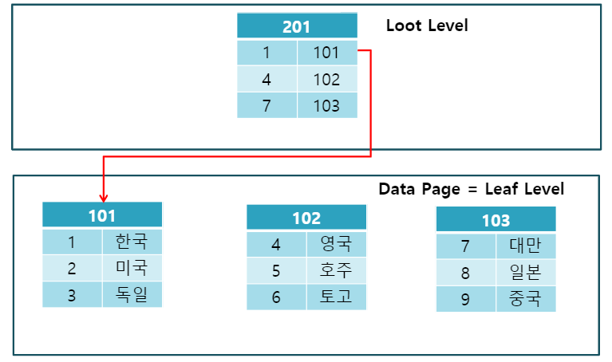
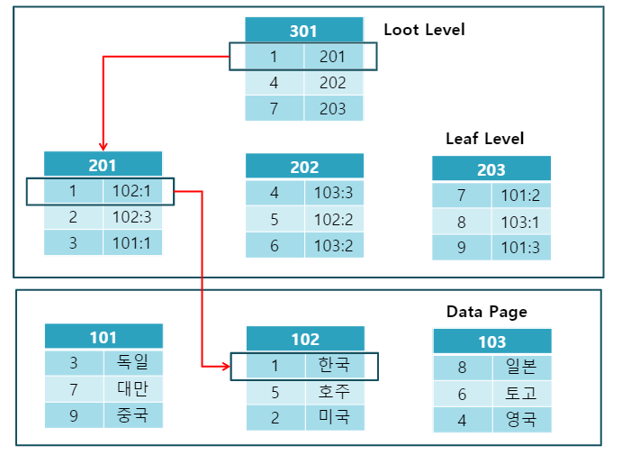

## 인덱스(Index)란?
DataBase에서 말하는 index는 일반적으로 책에서 보는 목차에 비유할 수 있다. 만약 책에서 특정 챕터를 찾아보고 싶다면, 책의 목차(index)를 찾고 목차에 적힌 페이지로 이동하면 된다.
즉, index는 **위치를 가리키는 지표**와 같은 것이다. 따라서 빠른 시간내에 원하는 자료를 찾을 수 있는 장점이 있다.

Index를 위한 추가 공간이 필요하고, 데이터가 많을경우 생성에 많은 시간이 소요 될 수 있다.

### Index 특징
Index는 열(Column) 단위로 생성이 되는데, 하나의 열에 Index를 생성할 수 있고, 여러 열에 하나의 Index를 생성 할 수도 있다.

테이블 생성 시 `Primary Key`를 지정하면 자동으로 `Clustered Index`가 생성된다.
`UNIQUE` 제약 조건만 있는 테이블을 생성하면 데이터베이스 엔진은 자동으로 `Non-Clustered Index`를 만든다.

`Primary Key`를 지정하는 열에 `NONCLUSTERED`키워드를 사용하여 강제적으로 `Non-Clustered Index`를 지정할 수 있다.

~~기존 테이블에 `Primary Key`를 추가할 때 이미 `Clustered Index`가 있는 경우 해당 Index를 기반으로 `Primary Key`가 생성이 된다.\
`Clustered Index`가 없는 경우에는 `Non-Clustered`가 생성이 된다.~~ (이해가 안된다.)

제약조건 없이 테이블을 생성 시 Index를 만들 수 없으며, Index를 생성하기 위한 열의 제약조건은 `Primary Key`, `Unique` 뿐이다.

Index는 `B-Tree` 구조를 가진다.
> ###  B-Tree?
> 데이터베이스와 파일 시스템에서 널리 사용되는 트리 자료구조의 일종으로, 이진 트리를 확장해 하나의 노드가 가질 수 있는 자식 노드의 최대 숫자가 2보다 큰 트리 구조이다.

> ### Clustered?
> 클러스터의 사전적 의미는 여러 원자 및 분자가 모여 하나의 덩어리를 이루고 있는 것이다. 하나의 구성단위를 뜻한다.

## Clustered Index
Clustered Index는 데이터가 테이블에 물리적으로 저장 되는 순서를 정의(설정)한다.\
즉, 클러스터 형 인덱스는 특정 컬럼을 기준으로 데이터들을 정렬시킨다. (데이터 삽입, 수정, 삭제시 테이블의 데이터를 정렬)

Clustered Index는 테이블당 하나만 존재할 수 있다. 새로운 데이가 생성이 되면 index는 테이블을 다시 정렬한다. 즉 데이터가 추가되거나 수정, 삭제된다면 속도가 느리다.

Clustered Index는 `Loot Level(루트 페이지)`와 `Leap Level(리프 페이지)`로 구성되며 리프레벨은 데이터 그 자체이다.
Clustered Index는 물리적으로 정렬되어 검색 속도가 빠르다.

## Non-Clustered Index
Non-Clustered Index는 테이블에 저장된 물리적인 순서에 따라 데이터를 정렬하지 않는다. 즉, 순서대로 정렬되어 있지 않다.

물리적으로 데이터를 배열하지 않은 상태로 데이터 페이지가 구성된다.\
테이블의 데이터는 그대로두고 지정된 컬럼에 대해 정렬시킨 인덱스를 만들 뿐이다.

Non-Clustered Index는 `데이터 페이지`를 건드리지 않고, 별도의 장소에 `인덱스 페이지`를 생성한다.\
인덱스 페이지는 `키값(정렬하여 인덱스 페이지 구성)`과 `위치 포인터(RID)`로 구성된다.

Non-Clustered Index는 검색 속도는 느리지만 입력, 수정, 삭제는 빠르다.

데이터를 찾을 떄 인덱스 엔트리인 루트 레벨에서 리프 레벨의 위치를 찾아 RID와 일치하는 데이터 페이지와 행 번호를 비교하여 데이터를 찾는다.